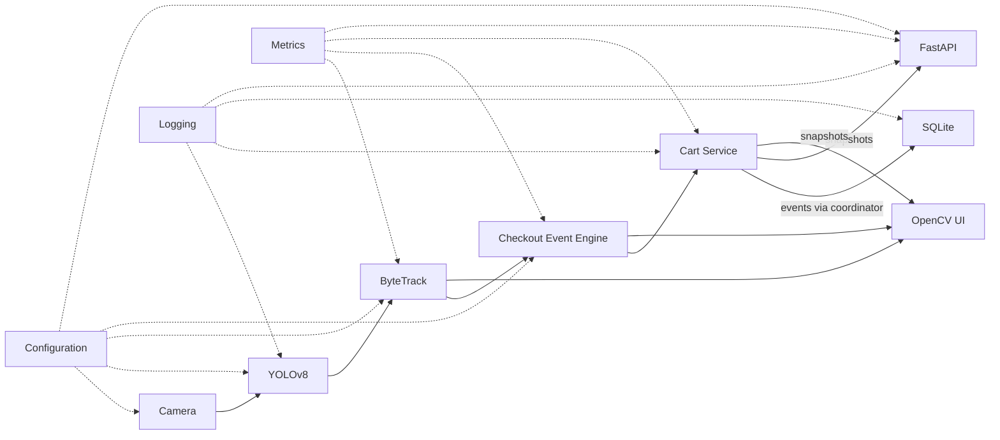

# Smart Retail & Checkout System

A local computer-vision portfolio project that detects, tracks, and checks out
retail-like objects from a Mac webcam. It combines YOLOv8 object detection,
ByteTrack multi-object tracking, a stateful checkout zone, an ID-aware shopping
cart, SQLite checkout history, and a live OpenCV interface.

The same in-memory cart and persisted history are exposed through a small local
FastAPI service. HTTP handlers read business state; YOLO inference remains in
the realtime webcam loop.

The project is intentionally small and interview-friendly. It demonstrates the
core ideas behind vision-assisted cashierless checkout without claiming to
reproduce the sensor coverage, identity systems, or operational reliability of
a production Amazon Go store.

## Problem statement

Object detection can answer *what is visible now*, but a checkout system also
needs to know whether an object is the same physical item seen in previous
frames and whether it crossed a meaningful boundary. This project connects
those responsibilities into a real-time pipeline and maintains deterministic
cart state despite repeated detections, short occlusions, and boundary jitter.

## Demo workflow

1. The webcam captures and horizontally mirrors each frame.
2. YOLOv8 detects only the configured product classes.
3. ByteTrack associates detections over time and assigns persistent track IDs.
4. The center of each tracked bounding box is evaluated against the checkout
   zone.
5. A confirmed `OUTSIDE -> INSIDE` transition adds that track to the cart.
6. A confirmed `INSIDE -> OUTSIDE` transition removes that exact track.
7. OpenCV renders detections, IDs, zone state, cart quantities, prices, total,
   FPS, device information, and short event notifications.
8. Successful cart changes are appended to the current SQLite checkout session.

## Architecture



The application uses a synchronous vision loop plus a local Uvicorn thread for
state-only HTTP requests. Each component has one clear responsibility. SQLite
is local and uses Python's standard library; no database server, cloud service,
or external GUI framework is required. See
[docs/PRODUCTION_ARCHITECTURE.md](docs/PRODUCTION_ARCHITECTURE.md) for component
boundaries, dependency direction, and the before/after design.
The concise current component map is in
[docs/ARCHITECTURE.md](docs/ARCHITECTURE.md).

## Technologies

- Python 3.11
- OpenCV for webcam capture and rendering
- Ultralytics YOLOv8 for object detection
- Ultralytics ByteTrack integration for multi-object tracking
- PyTorch with Apple MPS when available and CPU fallback
- NumPy for frame and tensor-adjacent data handling
- JSON and YAML for product and tracker configuration
- SQLite for local product, session, and cart-event history
- FastAPI and Pydantic for the local typed REST API
- Uvicorn for the background development API server
- pytest and Coverage.py for deterministic non-vision tests
- React, Vite, and TypeScript for the operator dashboard
- React Router for frontend navigation and Oxlint for frontend linting

## How object detection works

YOLOv8 processes an entire frame and returns bounding boxes, class predictions,
and confidence scores. The application starts from the lightweight
`yolov8n.pt` COCO checkpoint and asks the model only for configured classes.

ByteTrack receives detections down to a `0.10` association threshold so weak
observations can help preserve a track. Only detections at or above the `0.45`
application threshold reach the UI and checkout logic. The model is loaded once
at startup rather than once per frame.

An optional custom-training workflow is available in
[training/README.md](training/README.md). A compatible checkpoint can be
selected without changing application code:

```bash
SMART_RETAIL_MODEL_PATH=models/best.pt python app.py
```

Custom model class names must match `SMART_RETAIL_MODEL_ALLOWED_CLASSES` and
the keys in `src/smart_retail/configs/products.json`.

## How ByteTrack works

Detection and tracking are different jobs. YOLO identifies objects independently
in each frame; ByteTrack links those frame-level detections into trajectories.
At a high level, it predicts where existing tracks should move, matches new
detections to those tracks, and uses both strong and weaker detections to reduce
fragmentation. Each active trajectory receives a tracking ID.

This project uses Ultralytics' built-in ByteTrack integration with
`persist=True` and a local tracker configuration. Lost tracks remain buffered
for 60 frames, which helps with short hand occlusions. ByteTrack is still a
motion-based tracker and does not guarantee identity recovery after a long or
difficult disappearance.

## Preventing duplicate checkout

The cart is keyed by tracking ID rather than by class name:

```text
7  -> bottle
12 -> apple
```

Adding an existing ID is a no-op, so the same physical track cannot be counted
again while it remains inside. Different IDs of the same class are stored
separately and then aggregated for display, allowing two bottles to appear as
quantity two. Removing an unknown ID is safe.

## Checkout-zone algorithm

The checkout zone is a normalized rectangle covering approximately the
rightmost 30% of the frame. Normalized coordinates keep it usable across
different webcam resolutions.

For every tracked object, the center is calculated as:

```text
cx = (x1 + x2) / 2
cy = (y1 + y2) / 2
```

The zone stores the stable `inside` or `outside` state for each track. A new ID
first establishes a baseline and does not emit an event. A state change must
remain consistent for three consecutive visible frames before it is confirmed.
A 1.5% hysteresis margin uses slightly different entry and exit boundaries,
preventing repeated events when a centroid jitters along the edge.

Briefly missing tracks keep their state for a 90-frame application grace
period. If the same ID returns, its cart association survives. If it does not
return, the stale state and exact cart entry expire. The complete behavior
matrix is documented in [EDGE_CASES.md](EDGE_CASES.md).

## Project structure

```text
smart-retail-checkout/
├── app.py                         # Small convenience launcher
├── Dockerfile                     # Headless API production/test image
├── .dockerignore                  # Minimal, artifact-free build context
├── .github/workflows/ci.yml       # Hardware-free GitHub Actions validation
├── .env.example                   # Documented environment overrides
├── pyproject.toml                 # Package metadata and dependencies
├── EDGE_CASES.md
├── docs/
│   ├── ARCHITECTURE.md
│   ├── API.md
│   ├── CONCURRENCY.md
│   ├── DATABASE.md
│   ├── HEALTH_CHECKS.md
│   ├── INTERVIEW_GUIDE.md
│   ├── LIFECYCLE.md
│   ├── METRICS.md
│   ├── CONTAINERIZATION.md
│   ├── SECURITY.md
│   ├── TESTING.md
│   └── PRODUCTION_ARCHITECTURE.md
├── src/smart_retail/
│   ├── app.py                     # Composition and thin orchestration
│   ├── application_state.py       # Framework-neutral API snapshots
│   ├── config.py                  # Immutable startup configuration
│   ├── health.py                  # Thread-safe liveness/readiness state
│   ├── metrics.py                 # Bounded counters, gauges, and latency averages
│   ├── configs/                   # Packaged product catalog and ByteTrack defaults
│   ├── api/                       # FastAPI factory, routes, schemas, server
│   ├── domain/                    # Models, enums, and checkout events
│   ├── vision/                    # YOLO, ByteTrack, and timed pipeline
│   ├── checkout/                  # Zone, event engine, and cart service
│   ├── infrastructure/            # Camera, JSON catalog, and logging
│   │   └── sqlite_repository.py   # Transactional checkout history
│   └── presentation/              # OpenCV UI and window operations
├── tests/
│   ├── unit/                       # Pure domain/service and mocked adapters
│   ├── integration/                # SQLite, FastAPI, lifecycle, concurrency
│   └── contracts/                  # Packaging, CI, and container policy checks
├── frontend/                       # React/Vite operator-dashboard foundation
└── training/
    ├── data.yaml                  # Example custom dataset configuration
    ├── train.py                   # Opt-in local training entry point
    └── README.md                  # Dataset and training guide
```

Downloaded weights, local datasets, virtual environments, runtime databases,
and generated training runs are intentionally excluded from Git.

Resource ownership and the ordered, idempotent startup/shutdown contract are
documented in [docs/LIFECYCLE.md](docs/LIFECYCLE.md).

## macOS setup

The target environment is macOS with Python 3.11. Apple Silicon is recommended
but not required. CUDA is neither assumed nor needed.

Check for Python 3.11:

```bash
python3.11 --version
```

If it is unavailable and Homebrew is installed:

```bash
brew install python@3.11
```

macOS may request camera permission on the first run. Allow access for the
program that launches Python, such as Terminal, iTerm, or an IDE. Permissions
can be reviewed under **System Settings -> Privacy & Security -> Camera**.

## Installation

From the repository root:

```bash
"$(brew --prefix python@3.11)/bin/python3.11" -m venv .venv
source .venv/bin/activate
python -m pip install --upgrade pip
python -m pip install --editable ".[vision]"
```

The `vision` extra installs the native webcam runtime, including OpenCV,
Ultralytics, NumPy, PyTorch, ByteTrack's LAP dependency, and PyYAML. A plain
`python -m pip install --editable .` installs only the lightweight headless API
runtime used by the container.

Contributors who want the exact pinned lint, coverage, and test tools used by
CI can install all development extras directly:

```bash
python -m pip install --editable ".[vision,dev]"
```

`dev` adds pytest, directly pinned Coverage.py, Ruff, and FastAPI's HTTP test
client.
`pyproject.toml` is the single source of dependency declarations.

The first run may download `yolov8n.pt`; later runs use the local checkpoint.

## Configuration

Runtime configuration is loaded once into immutable dataclasses and validated
before the model or camera starts. Every override uses the `SMART_RETAIL_`
prefix. Invalid types, out-of-range thresholds, negative camera indices,
impossible zones, missing catalog/tracker files, and invalid ports stop startup
with a clear configuration error.

For a one-command override:

```bash
SMART_RETAIL_CAMERA_WIDTH=1920 \
SMART_RETAIL_CAMERA_HEIGHT=1080 \
SMART_RETAIL_MODEL_DEVICE=cpu \
python app.py
```

For a reusable local file, copy the safe example and export it into the shell:

```bash
cp .env.example .env
set -a
source .env
set +a
python app.py
```

The application reads environment variables; it does not silently load `.env`.
The real `.env` file is ignored by Git, while `.env.example` contains no
secrets.

| Variable | Default | Meaning |
|---|---|---|
| `SMART_RETAIL_CAMERA_INDEX` | `0` | OpenCV camera index |
| `SMART_RETAIL_CAMERA_WIDTH` | `1280` | Requested capture width |
| `SMART_RETAIL_CAMERA_HEIGHT` | `720` | Requested capture height |
| `SMART_RETAIL_MODEL_PATH` | `yolov8n.pt` | YOLO checkpoint |
| `SMART_RETAIL_MODEL_CONFIDENCE_THRESHOLD` | `0.45` | Trusted checkout detection threshold |
| `SMART_RETAIL_MODEL_IOU_THRESHOLD` | `0.70` | YOLO NMS IoU threshold |
| `SMART_RETAIL_MODEL_DEVICE` | `auto` | `auto`, `mps`, or `cpu` |
| `SMART_RETAIL_TRACKER_CONFIDENCE_THRESHOLD` | `0.10` | Low association threshold |
| `SMART_RETAIL_CHECKOUT_TRANSITION_CONFIRMATION_FRAMES` | `3` | Stable frames required for crossing |
| `SMART_RETAIL_CHECKOUT_TRACK_EXPIRY_GRACE_FRAMES` | `90` | Missing-track grace period |
| `SMART_RETAIL_UI_SHOW_FPS` | `true` | Show FPS in the OpenCV header |
| `SMART_RETAIL_LOG_LEVEL` | `INFO` | Standard Python log level |
| `SMART_RETAIL_LOG_JSON` | `false` | Emit one JSON object per log line |
| `SMART_RETAIL_LOG_FILE_PATH` | empty | Optional local log file |
| `SMART_RETAIL_LOG_FILE_MAX_BYTES` | `5000000` | Rotate the active file at this size |
| `SMART_RETAIL_LOG_FILE_BACKUP_COUNT` | `3` | Number of rotated files to retain |
| `SMART_RETAIL_DATABASE_ENABLED` | `true` | Enable local checkout history |
| `SMART_RETAIL_DATABASE_PATH` | `data/smart_retail.db` | SQLite database file |
| `SMART_RETAIL_DATABASE_BUSY_TIMEOUT_SECONDS` | `5.0` | Wait for a temporary SQLite lock |
| `SMART_RETAIL_API_ENABLED` | `true` | Run the local REST API with the webcam app |
| `SMART_RETAIL_API_HOST` | `127.0.0.1` | Local API bind address |
| `SMART_RETAIL_API_PORT` | `8000` | Local API port |
| `SMART_RETAIL_API_CORS_ALLOWED_ORIGINS` | `http://localhost:5173,http://127.0.0.1:5173` | Origins whose browsers may read CORS responses; Phase 1 uses `GET /health` |
| `SMART_RETAIL_METRICS_ROLLING_WINDOW_SIZE` | `60` | Recent frames retained for latency averages |

See [.env.example](.env.example) for every setting. ByteTrack's internal
algorithm thresholds and 60-frame buffer remain centralized in the packaged
`src/smart_retail/configs/bytetrack_retail.yaml`; they are not duplicated as
environment values. The packaged product catalog and tracker configuration are
available after both editable and wheel installation; environment variables
are only needed to select custom files.

## Containerized API

Docker packages the hardware-free FastAPI, cart, metrics, health, and SQLite
services. It deliberately does **not** package OpenCV, Ultralytics, PyTorch,
model weights, or the webcam loop. On Docker Desktop for macOS, direct access
to the Mac camera is not a dependable primary demo path; continue to use
`python app.py` for the live computer-vision experience.

Build and run the production image:

```bash
docker build --target production -t smart-retail-api:local .
docker volume create smart-retail-data
docker run --rm --name smart-retail-api \
  -p 8000:8000 \
  -v smart-retail-data:/app/data \
  smart-retail-api:local
```

Then inspect:

```bash
curl http://127.0.0.1:8000/health
curl http://127.0.0.1:8000/ready
open http://127.0.0.1:8000/docs
```

The headless readiness response reports `model`, `camera`, and
`vision_pipeline` as `disabled`, while core services and SQLite must be
`ready`. Container logs are emitted to stdout/stderr by default. Override safe
runtime settings with `-e`, for example:

```bash
docker run --rm -p 8080:8080 \
  -e SMART_RETAIL_API_PORT=8080 \
  -e SMART_RETAIL_LOG_JSON=true \
  -v smart-retail-data:/app/data \
  smart-retail-api:local
```

Run the hardware-free API integration tests inside the dedicated test stage:

```bash
docker build --target test -t smart-retail-api:test .
docker run --rm smart-retail-api:test
```

See [docs/CONTAINERIZATION.md](docs/CONTAINERIZATION.md) for image boundaries,
configuration, persistence, health checks, and macOS limitations.

## Logging and observability

The application uses Python's standard `logging` module and module-specific
logger names. Console logging is always enabled. Setting a file path adds a
bounded `RotatingFileHandler`; it does not disable the console. Human-readable
text is the default:

```text
14:20:08 | INFO | smart_retail.app | Cart item added | event="cart_item_added" cart_total=120 product="Water Bottle" quantity=1 track_id=14
```

Use JSON Lines for ingestion by production-style log tooling:

```bash
SMART_RETAIL_LOG_JSON=true \
SMART_RETAIL_LOG_FILE_PATH=logs/smart-retail.log \
python app.py
```

Each JSON line includes a UTC timestamp, level, module logger, message, event
name, and small event-specific fields. Logs include lifecycle, camera, model,
device, tracker, checkout, cart, reset, recovery, and shutdown events. They do
not include frames, webcam images, YOLO tensors, or full result objects.

| Level | Usage in this project |
|---|---|
| `DEBUG` | Opt-in per-frame/track diagnostics and ignored no-op state updates |
| `INFO` | Normal startup/shutdown, initialization, checkout transitions, cart changes, and reset |
| `WARNING` | Recoverable degradation such as a transient camera failure, CPU fallback, or unsupported product event |
| `ERROR` | A component failed and the current run cannot continue, or cleanup failed |
| `CRITICAL` | Startup configuration/initialization failed or an unexpected top-level failure occurred |

Unexpected exceptions are logged with tracebacks. Operational errors such as
an unavailable camera use concise fields and actionable messages. `INFO` never
logs every video frame; set `SMART_RETAIL_LOG_LEVEL=DEBUG` and enable debug mode
only when frame/track diagnostics are needed.

Thread-safe in-memory counters, gauges, rolling latency averages, and their
measurement boundaries are documented in [docs/METRICS.md](docs/METRICS.md).

## Local checkout history

SQLite stores the product catalog, one session per application run, and only
successful `ADD`, `REMOVE`, and explicit `RESET` events. The live cart remains
in memory, so the database is never queried per webcam frame. Each event stores
the unit price at the time of the change, preserving historical totals if the
catalog price later changes.

The schema is created safely on startup at `data/smart_retail.db` by default.
Database files and SQLite sidecars are ignored by Git. Disable persistence for
an ephemeral demo with:

```bash
SMART_RETAIL_DATABASE_ENABLED=false python app.py
```

If initialization or a write fails, the error is logged and webcam checkout
continues in memory. After an event-write failure, persistence is disabled for
the rest of that run to avoid recording a misleading partial sequence. See
[docs/DATABASE.md](docs/DATABASE.md) for the schema, repository API, transaction
policy, and inspection commands.

## REST API

The API starts with the webcam application by default at
`http://127.0.0.1:8000`. Swagger UI is available at
`http://127.0.0.1:8000/docs`, ReDoc at `/redoc`, and the generated OpenAPI
document at `/openapi.json`.

| Method | Path | Purpose |
|---|---|---|
| `GET` | `/health` | Process liveness and monotonic uptime |
| `GET` | `/ready` | Cached component readiness; `503` if a requirement is unavailable |
| `GET` | `/api/v1/cart` | Current aggregated in-memory cart |
| `POST` | `/api/v1/cart/reset` | Reset the shared cart and checkout lifecycle |
| `GET` | `/api/v1/events?limit=50` | Recent persisted cart events |
| `GET` | `/api/v1/sessions?limit=20` | Recent persisted sessions |
| `GET` | `/api/v1/sessions/{session_id}` | One session and its events |
| `GET` | `/api/v1/metrics` | Realtime performance, checkout, cart, and error metrics |

Example requests while `python app.py` is running:

```bash
curl http://127.0.0.1:8000/health
curl http://127.0.0.1:8000/ready
curl http://127.0.0.1:8000/api/v1/cart
curl http://127.0.0.1:8000/api/v1/metrics
curl -X POST http://127.0.0.1:8000/api/v1/cart/reset
```

Set `SMART_RETAIL_API_ENABLED=false` to run only the OpenCV application. The API
does not run inference and does not stream frames.

The same routes can run as a standalone headless service in the Docker image.
That mode owns a separate in-memory cart and SQLite session; it does not share
process memory with a simultaneously running native webcam process.

### Security posture

The API is designed for a trusted local machine and binds to `127.0.0.1` by
default. Responses disable MIME sniffing and shared caching, request parameters
are bounded and validated, and centralized error handlers never return Python
tracebacks or internal exception details. CORS shares responses with configured
local development origins only (by default `http://localhost:5173` and
`http://127.0.0.1:5173`) and never enables credentials. Its method allowlist
rejects preflight requests for methods other than `GET`, which is all the Phase
1 frontend uses. CORS is not authentication or method authorization: a simple
cross-origin `POST`, command-line client, or other non-browser client can still
reach the unauthenticated reset route. An unlisted browser origin normally
cannot read the response, but that does not secure the API. Binding to a
non-loopback address emits a warning because the API has no authentication.

`POST /api/v1/cart/reset` intentionally remains unrestricted for this local
demo. Do not expose it or checkout history directly to an untrusted network.
See [docs/SECURITY.md](docs/SECURITY.md) for the threat model, database and
filesystem safeguards, logging policy, known limitations, and the controls
required before a public deployment.

`/health` proves that the API process can respond; it does not claim that the
camera or model works. `/ready` reports `core_services`, `model`, `camera`,
`vision_pipeline`, and `database` from a thread-safe in-memory snapshot. It
returns `200` only while the application is running and every enabled critical
component is ready. Disabled SQLite is reported as `disabled` and does not fail
readiness. Neither endpoint opens the camera, runs inference, or queries SQLite.
See [docs/HEALTH_CHECKS.md](docs/HEALTH_CHECKS.md) for responses, transitions,
and deployment usage.
The complete endpoint contract, examples, error model, and execution-mode
differences are documented in [docs/API.md](docs/API.md).

## Frontend

The `frontend/` directory contains a separate React, Vite, and TypeScript
operator-dashboard foundation. Start the native backend for shared webcam and
API state in one terminal:

```bash
source .venv/bin/activate
smart-retail
```

Then start the frontend in another terminal:

```bash
cd frontend
npm ci
npm run dev
```

The optional `frontend/.env` file can override
`VITE_API_BASE_URL=http://localhost:8000`; it is ignored by Git. In Phase 1,
the dashboard makes one real `GET /health` request and does not replace the
OpenCV interface. See [frontend/README.md](frontend/README.md) for the
hardware-free `smart-retail-api` alternative and frontend commands.

### Thread safety

Uvicorn runs in background worker threads while OpenCV remains on the main
thread. Small non-reentrant locks separately protect cart membership, checkout
commands, health/session state, and UI notification state. API and UI
consumers receive immutable cart and checkout snapshots. Inference, frame
capture, rendering, and SQLite history reads stay outside shared-state critical
sections; health snapshots use their own short in-memory lock. See
[docs/CONCURRENCY.md](docs/CONCURRENCY.md) for the
ownership matrix, reset ordering, persistence policy, and deadlock rules.

## Running the application

Activate the environment and start the webcam application:

```bash
source .venv/bin/activate
python app.py
```

Editable installation also provides an equivalent console command:

```bash
smart-retail
```

The API-only runtime can be started with `smart-retail-api`.

Run the deterministic test suite:

```bash
python -m pytest tests -q
```

Run the same code-quality checks as CI:

```bash
python -m ruff check app.py src tests training
python -m ruff format --check app.py src tests training
```

See [docs/TESTING.md](docs/TESTING.md) for test categories, the combined 85%
branch-coverage command, and the manual hardware smoke-test checklist.

If camera index `0` does not open, confirm macOS camera permission and close any
other application currently using the webcam.

## Continuous integration

GitHub Actions validates pushes to `main` and `develop`, pull requests, and
manual runs using Python 3.11. A lightweight job first proves the base package
imports and runs its headless service integration tests without vision extras.
The main job performs Ruff lint/format checks, then runs `tests/unit` and
`tests/contracts` before `tests/integration`, with an 85% combined
branch-coverage gate. Neither job opens a webcam, creates a GUI window, loads
model weights, runs live inference, or requires a GPU, MPS, secrets, or
external services.

The coverage XML is available as a workflow artifact. A CI badge will be added
after the repository has a verified GitHub remote, avoiding a broken or
misleading badge URL.

## Keyboard controls

| Key | Action |
|---|---|
| `Q` | Quit and release the webcam |
| `R` | Clear cart and zone lifecycle state |
| `D` | Toggle centroids, zone states, IDs, and inference timing |

The OpenCV window must have keyboard focus. Pressing Enter is not required.

## Supported products

The default COCO-based demo supports:

| Detector class | Display name | Unit price |
|---|---|---:|
| `bottle` | Water Bottle | ₹40 |
| `cup` | Coffee Cup | ₹199 |
| `banana` | Banana | ₹30 |
| `apple` | Apple | ₹45 |
| `orange` | Orange | ₹35 |

Products and integer rupee prices are configured in the packaged
`src/smart_retail/configs/products.json` catalog.

## Known limitations

- The default COCO model recognizes broad categories, not exact brands or SKUs.
- ByteTrack has no appearance-based re-identification; an ID may change after a
  long occlusion or abrupt motion.
- A replacement ID first seen inside the zone creates a baseline rather than an
  `ENTER`, avoiding a duplicate at the cost of a possible missed addition.
- The cart removes an item when the same track exits the zone; this is a simple
  crossing simulation, not a complete physical-store workflow.
- A single RGB webcam cannot resolve every overlap, handoff, shelf interaction,
  or visually identical product.
- The live cart resets when the process ends; SQLite retains event history but
  does not restore an interrupted cart into a new run.
- The local REST API has no authentication, authorization, or rate limiting and
  must not be exposed directly to an untrusted network.
- The API exposes business state only; it intentionally has no video stream.
- Track expiry is frame-based, so its wall-clock duration changes with FPS.
- Performance depends on lighting, object size, camera quality, and available
  CPU or MPS resources.

## Future improvements

- Train and evaluate a SKU-specific grocery dataset using the prepared workflow.
- Add calibration tools for defining zones from the live frame.
- Tune detection and ByteTrack thresholds from recorded evaluation clips.
- Add appearance embeddings or multi-camera identity association for difficult
  occlusions.
- Separate scan/commit/removal policy from physical zone occupancy.
- Add receipt export and a session-history viewer over the persisted events.
- Add authentication and authorization before any non-local API deployment.
- Explore shelf sensors, weight verification, and multiple viewpoints for a
  more realistic retail system.

## Interview explanation

> This project turns independent webcam detections into a stateful checkout
> simulation. YOLOv8 identifies supported objects, ByteTrack gives each physical
> trajectory an ID, and a centroid-based zone state machine emits one event per
> stable crossing. The cart is keyed by track ID, so repeated detections do not
> repeatedly charge the same object, while multiple objects of one class still
> aggregate correctly. Hysteresis, consecutive-frame confirmation, and a
> tracking-loss grace period handle the most common real-time edge cases. The
> system runs locally on macOS with MPS or CPU, persists meaningful history in
> SQLite, and keeps each concern in a small, testable module.

For concise technical interview answers, see
[docs/INTERVIEW_GUIDE.md](docs/INTERVIEW_GUIDE.md).
