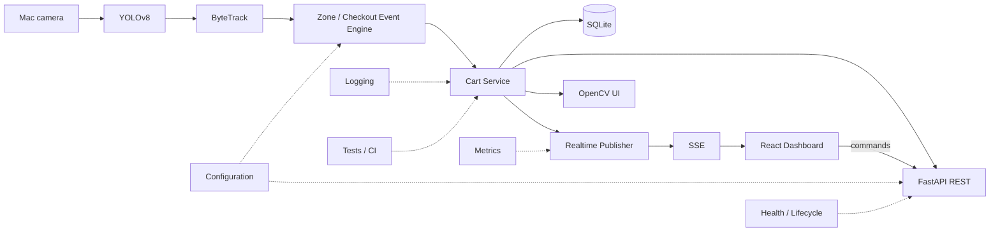

# Smart Retail & Checkout System

[](https://github.com/SHUBHANGSUDHANSU/smart-retail-checkout/actions/workflows/ci.yml)

A local, end-to-end cashierless-checkout simulation built for macOS. A webcam
feeds YOLOv8 and ByteTrack, a debounced checkout-zone engine converts movement
into deterministic cart events, and a React operations dashboard receives live
updates through FastAPI and Server-Sent Events (SSE).

This is a portfolio-scale simulation of the engineering ideas behind automated
checkout—not an Amazon Go replacement. It uses one RGB camera, a small COCO
class set, and an explainable zone-crossing rule.

## Demo

The project has two deliberately separate visual surfaces:

- the native OpenCV window shows the camera, detections, track IDs, checkout
  zone, and cart overlay;
- the React dashboard shows cart state, events, sessions, health, readiness,
  metrics, and realtime connection state.

When camera or model hardware is unavailable, an opt-in **DEMO MODE** sends
controlled synthetic actions through the real CartService, SQLite, metrics,
REST, and SSE paths. It never presents those events as computer-vision output.

See [the demo runbook](docs/DEMO.md) for the live walkthrough, recording plan,
and screenshot checklist. No fabricated screenshots are committed.

## Features

- YOLOv8n object detection with Apple MPS selection and CPU fallback
- Ultralytics ByteTrack integration with persistent per-object track IDs
- normalized checkout zone with hysteresis, confirmation frames, and expiry
- track-ID-keyed cart that prevents duplicate billing and aggregates quantities
- native OpenCV operator overlay and keyboard controls
- thread-safe FastAPI state API with liveness and meaningful readiness
- SQLite products, sessions, and append-only cart-event history
- bounded in-process SSE broadcaster with REST snapshot reconciliation
- React, Vite, and TypeScript operations dashboard
- structured logging, rotating-file option, and operational metrics
- deterministic hardware-free tests, coverage enforcement, Ruff, and CI
- explicitly labeled hardware-free demo mode

## Architecture



The application is a modular monolith. Domain and checkout code do not depend
on OpenCV, Ultralytics, FastAPI, SQLite, terminal output, or React. The native
process owns inference; HTTP handlers never run YOLO. Full component and
dependency details are in [docs/ARCHITECTURE.md](docs/ARCHITECTURE.md).

## How it works

1. OpenCV captures and mirrors a webcam frame.
2. YOLOv8 returns configured classes, bounding boxes, and confidence scores.
3. ByteTrack associates detections across sequential frames and supplies IDs.
4. The event engine classifies each bounding-box centroid as inside or outside.
5. Hysteresis plus three confirming frames suppresses boundary oscillation.
6. `OUTSIDE -> INSIDE` adds the exact track; `INSIDE -> OUTSIDE` removes it.
7. CartService aggregates physical tracks into product quantities and totals.
8. Meaningful changes are persisted and published as full, idempotent snapshots.
9. React bootstraps through REST, then consumes one shared SSE connection.

Short occlusions are handled by ByteTrack's buffer and an application-level
track grace period. The application never invents a replacement ID. If an ID
changes, the new inside track establishes a baseline instead of creating an
immediate duplicate charge; the stale prior track eventually expires.

## Tech stack

| Area | Technology |
|---|---|
| Vision | Python 3.11, OpenCV, Ultralytics YOLOv8, ByteTrack, NumPy, PyTorch |
| Backend | FastAPI, Pydantic, Uvicorn, standard logging |
| Data | SQLite, JSON product catalog, YAML tracker configuration |
| Frontend | React, Vite, TypeScript, React Router, plain CSS |
| Realtime | Server-Sent Events with bounded per-client queues |
| Quality | pytest, Coverage.py, Ruff, Vitest, Testing Library, Oxlint |
| Delivery | GitHub Actions; optional headless Docker image |

## Quick start on macOS

Prerequisites: Python 3.11, Node.js `^20.19`, `^22.12`, or `>=24`, and a Mac
camera for vision mode. Terminal or your IDE may need permission under
**System Settings → Privacy & Security → Camera**.

```bash
git clone https://github.com/SHUBHANGSUDHANSU/smart-retail-checkout.git
cd smart-retail-checkout
python3.11 -m venv .venv
source .venv/bin/activate
python -m pip install --upgrade pip
python -m pip install -e ".[vision,dev]"
cd frontend
npm ci
cp .env.example .env
cd ..
```

`yolov8n.pt` is downloaded by Ultralytics on first vision use. CUDA is not
assumed. Set `SMART_RETAIL_MODEL_DEVICE=cpu` to force CPU execution.

## Running the application

### Vision mode

Terminal 1:

```bash
source .venv/bin/activate
smart-retail
```

Terminal 2:

```bash
cd frontend
npm run dev
```

Open [http://localhost:5173](http://localhost:5173). The embedded API is at
[http://localhost:8000](http://localhost:8000), and Swagger is at
[http://localhost:8000/docs](http://localhost:8000/docs).

### API-only mode

```bash
source .venv/bin/activate
smart-retail-api
```

This starts business/API services without camera, model, tracker, or GUI. Those
readiness components are reported as `disabled`, not falsely `ready`.

### Demo mode

After the one-time installation above:

```bash
./scripts/run-demo.sh
```

The helper starts the API and frontend, selects `data/smart_retail_demo.db`,
waits for backend liveness, and shuts down both child processes on exit. The UI
shows **DEMO MODE** and states that computer vision is inactive. Demo mode is
off by default and `smart-retail` refuses to start vision while it is enabled.

Equivalent manual commands:

```bash
export SMART_RETAIL_DEMO_MODE=true
export SMART_RETAIL_DATABASE_PATH=data/smart_retail_demo.db
smart-retail-api
```

```bash
cd frontend
npm run dev
```

## Configuration

Configuration is loaded once from `SMART_RETAIL_*` environment variables and
validated before startup. The application does not automatically load `.env`;
export variables in the shell or use your process manager. See [.env.example](.env.example)
for every safe default.

Common settings:

```bash
export SMART_RETAIL_CAMERA_INDEX=0
export SMART_RETAIL_MODEL_CONFIDENCE_THRESHOLD=0.45
export SMART_RETAIL_MODEL_DEVICE=auto
export SMART_RETAIL_DATABASE_PATH=data/smart_retail.db
export SMART_RETAIL_API_PORT=8000
export SMART_RETAIL_DEMO_MODE=false
```

The frontend uses `VITE_API_BASE_URL=http://localhost:8000` from its ignored
local environment file. Explicit local CORS origins are configured through
`SMART_RETAIL_API_CORS_ALLOWED_ORIGINS`; wildcard origins are rejected.

## API overview

| Method | Path | Purpose |
|---|---|---|
| `GET` | `/health` | Process liveness and uptime |
| `GET` | `/ready` | Cached component readiness |
| `GET` | `/api/v1/cart` | Consistent cart snapshot |
| `POST` | `/api/v1/cart/reset` | Shared cart reset command |
| `GET` | `/api/v1/events` | Recent persisted events |
| `GET` | `/api/v1/sessions` | Recent checkout sessions |
| `GET` | `/api/v1/sessions/{id}` | Session detail and event history |
| `GET` | `/api/v1/metrics` | Current metrics snapshot |
| `GET` | `/api/v1/stream` | `cart.updated`, `checkout.event`, and `metrics.updated` SSE |
| `GET/POST` | `/api/v1/demo...` | Conditionally registered demo controls |

Demo routes are absent from routing and OpenAPI unless demo mode is enabled.
The API is unauthenticated and binds to loopback by default; see
[docs/API.md](docs/API.md) and [docs/SECURITY.md](docs/SECURITY.md).

## Keyboard controls

| Key | Action |
|---|---|
| `Q` | Quit and release resources |
| `R` | Reset cart and checkout state |
| `D` | Toggle debug overlay |

## Supported demo products

The default catalog is configuration, not UI data:

| Detector class | Product | Price |
|---|---|---:|
| `bottle` | Water Bottle | ₹40 |
| `cup` | Coffee Cup | ₹199 |
| `banana` | Banana | ₹30 |
| `apple` | Apple | ₹45 |
| `orange` | Orange | ₹35 |

These are broad COCO classes rather than retail SKUs. The optional
[custom training workflow](training/README.md) explains how to prepare a
small YOLO-format grocery dataset and configure `models/best.pt`.

Run the deterministic test suite:

```bash
python -m pytest tests -q
```

Run the same code-quality checks as CI:

```bash
python -m ruff check app.py src tests training
python -m ruff format --check app.py src tests training
```

## Continuous integration

Backend coverage can be inspected locally with:

```bash
python -m pytest tests -q --cov=smart_retail --cov-branch
```

```bash
cd frontend
npm run lint
npm test
npm run build
```

CI runs without a webcam, GUI, MPS, GPU, live model inference, network calls,
or cloud services. Hardware boundaries are mocked; domain, API, SQLite,
realtime, lifecycle, and concurrency behavior use real deterministic services.
See [docs/TESTING.md](docs/TESTING.md).

## Architecture decisions

- **YOLOv8n:** a practical latency/accuracy starting point for local inference.
- **ByteTrack:** integrates with Ultralytics and can use weaker detections to
  maintain short associations without another tracking framework.
- **FastAPI:** typed state APIs and generated OpenAPI without inference in routes.
- **SQLite:** transactional local history with no external database service.
- **SSE:** one-way server-to-browser state is the dominant realtime requirement;
  commands remain normal REST calls.
- **React:** a typed, responsive operations surface kept separate from OpenCV.
- **Modular monolith:** explicit boundaries without premature microservices.

## Known limitations

- ByteTrack is motion-based, not appearance-based re-identification; long or
  difficult occlusion can cause ID switches.
- A COCO checkpoint recognizes broad object categories, not specific SKUs.
- One camera cannot provide store-scale coverage or cross-camera identity.
- Centroid-zone logic is a simplified checkout policy, not shelf-pickup intent.
- The in-process SSE broadcaster supports one backend process only.
- There is no browser video stream, payment flow, authentication, or rate limit.
- SQLite is suitable for this local single-writer edge demo, not distributed
  multi-store transactions.
- Demo mode proves backend/frontend behavior with synthetic commands; it does
  not validate detection or tracking accuracy.

## Future improvements

- fine-tune a SKU-specific grocery detector;
- add appearance-based re-identification and calibrated multi-camera handoff;
- replace in-process realtime publication with Redis/pub-sub for multiple API
  instances;
- add WebRTC only if browser video becomes a real requirement;
- integrate an authenticated product catalog and auditable payment workflow;
- add model/data monitoring and human review for ambiguous checkout events.

## Project documentation

- [Demo and recording guide](docs/DEMO.md)
- [Architecture](docs/ARCHITECTURE.md)
- [Realtime design](docs/REALTIME.md)
- [API](docs/API.md)
- [Database](docs/DATABASE.md)
- [Concurrency](docs/CONCURRENCY.md)
- [Health checks](docs/HEALTH_CHECKS.md)
- [Metrics](docs/METRICS.md)
- [Lifecycle](docs/LIFECYCLE.md)
- [Security](docs/SECURITY.md)
- [Testing and CI](docs/TESTING.md)
- [Interview guide and resume copy](docs/INTERVIEW_GUIDE.md)
- [Current project status](docs/PROJECT_STATUS.md)

No software license is currently included. All runtime data, model weights,
datasets, local databases, logs, and generated training output are excluded
from Git.
