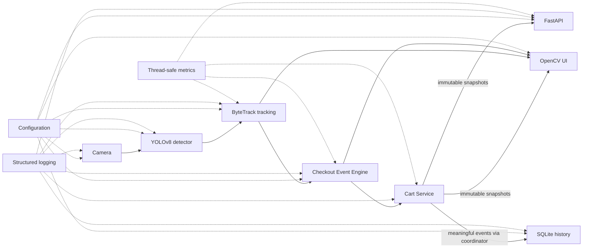
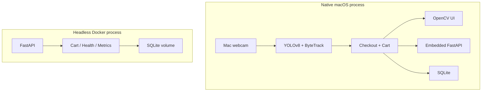

# Architecture

Smart Retail Checkout is a modular monolith: one local Python process owns the
realtime webcam loop and can run a background FastAPI server over the same
business state. The container entry point reuses the API, cart, health, metrics,
and persistence components without loading computer-vision dependencies.

## System data flow

Solid arrows show runtime data flow. Dotted arrows show cross-cutting
configuration, logging, or measurement. The `CartService -> SQLite` arrow is a
business-event flow, not a direct code dependency: the application coordinator
persists an event only after the cart mutation succeeds. The cart remains a
small, framework-independent in-memory service.

## Component responsibilities

| Component | Responsibility | Depends on | Independently testable |
|---|---|---|---|
| `domain/models.py` | Frozen products, tracks, cart items, cart snapshots, and sessions | Python standard library | Yes |
| `domain/events.py` | Zone, checkout, and persisted cart event values | Domain models | Yes |
| `vision/detector.py` | Load one YOLO model, resolve device, expose model metadata | Ultralytics, PyTorch, logging | With model boundary replaced |
| `vision/tracker.py` | Call Ultralytics tracking with ByteTrack persistence and translate safe result tensors into `TrackedObject` values | Detector, NumPy, PyTorch, domain | With detector/model boundary replaced |
| `vision/pipeline.py` | Time one tracking operation and return immutable vision output | Tracker, monotonic clock | Yes |
| `checkout/zone.py` | Convert normalized bounds into pixel geometry and apply entry/exit hysteresis | Domain values | Yes |
| `checkout/event_engine.py` | Maintain stable/pending/missing track state and emit debounced `ENTER`/`EXIT` transitions | Zone, domain, clock | Yes |
| `checkout/cart.py` | Key physical items by track ID, aggregate products, and return consistent immutable snapshots | Domain models, one lock | Yes |
| `infrastructure/camera.py` | Own OpenCV `VideoCapture`, retry bounded reads, mirror frames, and release idempotently | OpenCV, camera config | With capture boundary replaced |
| `infrastructure/sqlite_repository.py` | Initialize schema and transactionally persist products, sessions, and meaningful cart events | SQLite, domain | Yes, using temporary files |
| `infrastructure/logging_config.py` | Configure readable or JSON event logs and optional rotating files | Standard logging, logging config | Yes |
| `presentation/opencv_ui.py` | Render frames, zones, tracks, cart snapshots, notifications, and keyboard-visible help | OpenCV, immutable snapshots | With OpenCV drawing boundary replaced |
| `api/` | Validate HTTP input and serialize shared business snapshots and persisted history | FastAPI, Pydantic, `APIRuntime` protocol | Yes, through `TestClient` |
| `health.py` | Store thread-safe lifecycle and component readiness transitions | Application-state enum | Yes |
| `metrics.py` | Store thread-safe counters, gauges, and bounded rolling latency averages | Domain snapshots, clock | Yes |
| `config.py` | Load and validate immutable startup configuration once | Standard library | Yes |
| `app.py` | Compose dependencies, coordinate one frame loop, order business/persistence effects, and own lifecycle | All adapters and services | Yes, with hardware boundaries replaced |

## Dependency direction

The domain layer does not import OpenCV, Ultralytics, FastAPI, SQLite, or the
logging adapter. Checkout services depend inward on domain values. Vision and
infrastructure translate external library data into those values.
Presentation layers consume immutable snapshots rather than internal mutable
containers.

The default product catalog and ByteTrack YAML live under
`smart_retail/configs` as package data. Consequently, editable installs and
built wheels use the same canonical files rather than relying on the source
repository layout. Operator-supplied relative database/log paths still resolve
from the source project root during development and from the current working
directory in an installed runtime.

FastAPI routes depend on the structural `APIRuntime` protocol. Both
`SmartRetailApplication` and `HeadlessAPIRuntime` satisfy that protocol without
inheriting from a framework base class. This keeps routes independent of the
webcam coordinator and avoids a dependency-injection framework.

`SmartRetailApplication` is the composition root and lifecycle coordinator. It
is intentionally the only native component that knows about camera, vision,
checkout, persistence, UI, health, metrics, and the background API together.
Its methods delegate algorithms and state rules to smaller components; it does
not contain YOLO, ByteTrack, zone geometry, cart aggregation, SQL, or OpenCV
drawing algorithms.

## Realtime sequence

1. `OpenCVCamera` returns a mirrored BGR frame.
2. `VisionPipeline` times `ByteTracker.track()`.
3. Ultralytics runs YOLO and ByteTrack for the sequential frame.
4. `ByteTracker` returns a tuple of validated `TrackedObject` values. Missing
   detections and missing IDs produce safe empty or ID-less observations.
5. `CheckoutEventEngine` evaluates centroids, hysteresis, confirmation frames,
   and missing-track expiry.
6. The coordinator serializes the resulting checkout command with API reset,
   mutates `CartService`, then persists only a successful `ADD`, `REMOVE`, or
   `RESET` event.
7. Metrics receive bounded numeric updates and `OpenCVUI` renders immutable
   checkout/cart snapshots.
8. FastAPI workers may concurrently read snapshots or SQLite history; they
   never run inference.

## State and consistency

The realtime cart is keyed by track ID and optimized in memory. SQLite is an
append-oriented history of meaningful business events rather than a per-frame
store. This separation keeps database work out of inference and rendering.

Cart snapshots aggregate quantities and totals while holding the cart lock
once. Checkout mutation and reset share a command lock so either the crossing
or reset linearizes first. SQLite reads use short-lived connections outside
application locks. Full ownership and lock ordering are documented in
[CONCURRENCY.md](CONCURRENCY.md).

## Lifecycle and failure boundaries

Startup loads configuration and logging before initializing persistence,
vision, camera, and API resources. Shutdown stops new work, ends the frame loop,
closes the active checkout session, releases the camera and OpenCV windows,
closes SQLite ownership, and stops remaining services. Cleanup is idempotent
and preserves an original exception if cleanup also fails. See
[LIFECYCLE.md](LIFECYCLE.md).

Recoverable persistence failure disables history for the rest of the run rather
than crashing webcam checkout or producing a misleading partial sequence.
Camera exhaustion or an unexpected vision failure changes health state and
drives ordered shutdown. API exception handlers return stable safe messages;
tracebacks remain server-side.

## Native and container execution modes

The modes reuse domain services, Pydantic schemas, route modules, and the SQLite
repository, but they are independent processes with independent in-memory
carts. Docker Desktop on macOS is not the supported webcam path; native Python
remains the primary vision demonstration.

## Deliberate tradeoffs

- This is a modular monolith, not a microservice system.
- `SmartRetailApplication`, `OpenCVUI`, configuration, and the SQLite adapter
  are larger modules because each owns one integration concern with many small
  operations. Splitting them solely by line count would add navigation and
  lifecycle complexity without changing responsibility boundaries.
- The cart does not know about SQLite or FastAPI; coordination code explicitly
  orders side effects.
- SQLite and standard-library locks are sufficient for one local process. They
  are not a multi-instance consistency design.
- ByteTrack identity is accepted only when provided by the tracker. The event
  engine never invents IDs or appearance matches.

More detail is available in [API.md](API.md), [DATABASE.md](DATABASE.md),
[CONCURRENCY.md](CONCURRENCY.md), [HEALTH_CHECKS.md](HEALTH_CHECKS.md),
[METRICS.md](METRICS.md), and [SECURITY.md](SECURITY.md).
