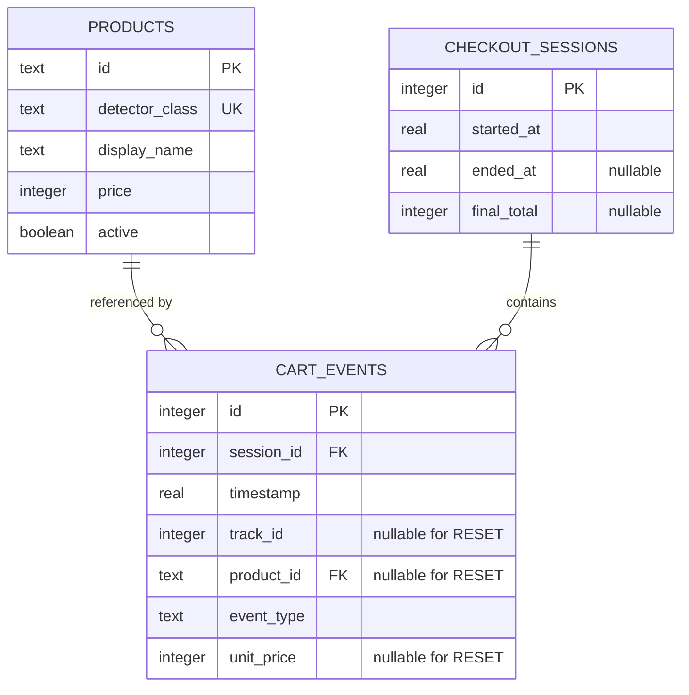

# Local SQLite persistence

## Purpose

SQLite stores checkout history for this local edge-computing demo. The realtime
cart remains in memory because it is read on every rendered frame; SQLite is
used only at startup, for meaningful cart mutations, and at shutdown.

The implementation uses Python's built-in `sqlite3` module and explicit SQL in
`infrastructure/sqlite_repository.py`. There is no ORM or database server.

## Schema



### `products`

The JSON catalog is synchronized during database initialization. Current
products are inserted or updated and marked active. Rows missing from the
current catalog are retained and marked inactive so historical event foreign
keys remain valid.

Prices are nonnegative integer currency units. With the default catalog, `40`
means ₹40. `detector_class` is unique and maps a model class such as `bottle` to
a stable product ID.

### `checkout_sessions`

One row is created when an application run starts. Normal shutdown sets both
`ended_at` and `final_total` in one transaction. A session with both values
`NULL` is incomplete—for example, after a process crash or after persistence
was disabled because a write failed.

### `cart_events`

Only successful business changes are appended:

| Event | Meaning | Product/track fields |
|---|---|---|
| `ADD` | A confirmed zone entry added one exact tracked item | Required |
| `REMOVE` | Zone exit or track expiry removed that exact item | Required |
| `RESET` | The user explicitly reset cart and checkout state | Must be `NULL` |

Duplicate adds, unknown removes, unsupported detector classes, detections, and
frames do not create rows. `unit_price` is copied into `ADD` and `REMOVE` events
as a historical snapshot; later catalog changes do not rewrite old events.

Timestamps are Unix seconds in UTC. SQLite stores them as `REAL`; conversion to
a formatted timezone is a presentation concern.

## Integrity and transactions

- All runtime values use SQL placeholders (`?`), including IDs, names, prices,
  timestamps, limits, and event fields.
- Foreign keys are enabled on every connection.
- Table checks reject invalid prices, event types, partially closed sessions,
  and malformed event shapes.
- Every write uses a connection transaction. Exceptions roll back the current
  write before they are translated to `PersistenceError`.
- The schema uses `CREATE TABLE/INDEX IF NOT EXISTS` and SQLite
  `PRAGMA user_version = 1` for safe repeat initialization.
- History reads open separate short-lived connections and never mutate the
  in-memory cart.

## Repository API

`SQLiteCheckoutRepository` exposes:

- `initialize(products)` — create/validate schema and synchronize products.
- `create_session()` — create and return an open `CheckoutSession`.
- `close_session()` — atomically store end time and final total.
- `record_cart_event()` — append one `ADD`, `REMOVE`, or `RESET`.
- `get_session()` — retrieve one session by ID.
- `get_recent_sessions()` — retrieve bounded newest-first history.
- `get_session_events()` — retrieve deterministic event order for a session.
- `get_recent_events()` — retrieve bounded newest-first event history for the
  REST API.

Returned sessions and cart events are immutable domain dataclasses.

## Failure policy

In native webcam mode, schema initialization failure is logged and the
application starts with its normal in-memory cart. A session-creation or
cart-event write failure also logs a traceback and disables persistence for the
remainder of that run. This prevents later successful writes from making a
partial event sequence look complete. Webcam capture, detection, tracking,
checkout, cart display, and keyboard controls continue.

In headless API mode, enabled SQLite is the service's only history dependency.
Initialization failure fails lifespan startup. A history read or reset-event
write failure increments the persistence-error metric, marks database readiness
unavailable, and becomes a safe HTTP `503`; it does not expose the underlying
SQLite error. A later successful history operation may restore readiness.

Shutdown close failures are logged. The session remains incomplete rather than
storing a final total that could falsely imply complete history.

## Configuration

```bash
SMART_RETAIL_DATABASE_ENABLED=true
SMART_RETAIL_DATABASE_PATH=data/smart_retail.db
SMART_RETAIL_DATABASE_BUSY_TIMEOUT_SECONDS=5.0
```

During source development, relative paths resolve from the repository root. In
an installed console runtime, they resolve from the current working directory.
Database files and SQLite sidecars are ignored by Git. To run without history:

```bash
SMART_RETAIL_DATABASE_ENABLED=false python app.py
```

## Local inspection

With the optional macOS `sqlite3` command-line tool:

```bash
sqlite3 data/smart_retail.db ".tables"
sqlite3 -header -column data/smart_retail.db \
  "SELECT id, started_at, ended_at, final_total FROM checkout_sessions ORDER BY id DESC LIMIT 10;"
sqlite3 -header -column data/smart_retail.db \
  "SELECT session_id, event_type, track_id, product_id, unit_price FROM cart_events ORDER BY id DESC LIMIT 20;"
```

These inspection queries are operational tools; the webcam loop never executes
them.
