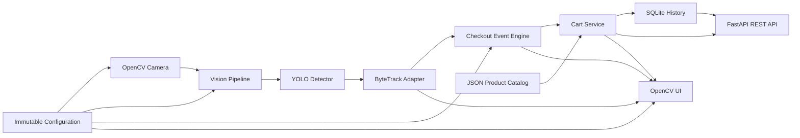
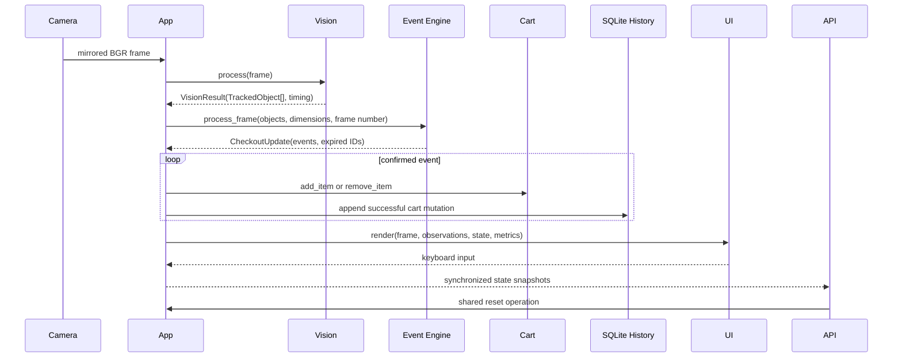
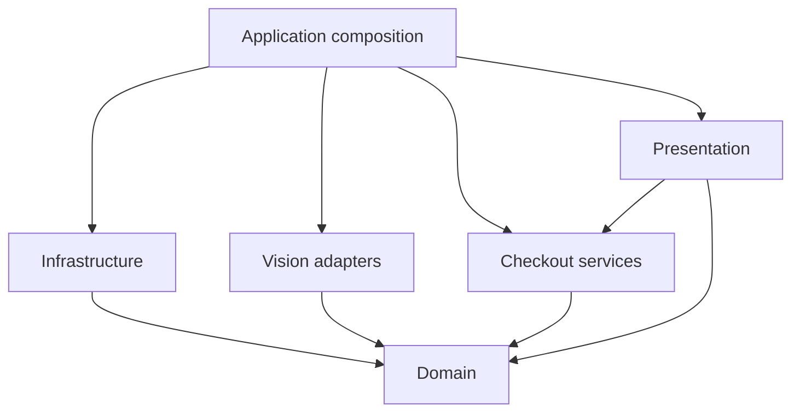

# Production-style architecture

## Purpose

This refactor moves the working prototype toward production-style boundaries
without changing its computer-vision and checkout behavior. The result remains
one understandable local process, but framework adapters no longer define core
business concepts.



## Architecture before

The prototype used a small flat module layout. It was appropriate while the
features were being built phase by phase, but several responsibilities became
coupled:

- `TrackedObject` lived in the Ultralytics detector module.
- Zone geometry, transition confirmation, event creation, and expiry shared one
  class.
- `CartManager` loaded JSON, owned business state, and printed to the terminal.
- The webcam loop handled capture retries, mirroring, timing, event policy,
  resource cleanup, keyboard input, and OpenCV window operations.
- Configuration was imported as module-level constants throughout the process.

All 31 prototype tests passed before the refactor, establishing a behavioral
baseline.

## Architecture after

```text
src/smart_retail/
├── app.py
├── application_state.py
├── config.py
├── configs/
│   ├── bytetrack_retail.yaml
│   └── products.json
├── health.py
├── metrics.py
├── api/
│   ├── factory.py
│   ├── models.py
│   ├── server.py
│   └── routes/
├── domain/
│   ├── models.py
│   └── events.py
├── vision/
│   ├── detector.py
│   ├── tracker.py
│   └── pipeline.py
├── checkout/
│   ├── zone.py
│   ├── event_engine.py
│   └── cart.py
├── infrastructure/
│   ├── camera.py
│   ├── logging_config.py
│   ├── repository.py
│   └── sqlite_repository.py
└── presentation/
    └── opencv_ui.py
```

Only modules with current responsibilities were created. There is no
dependency-injection framework, ORM, or abstract repository hierarchy.

## Component responsibilities

### Domain models and events

`domain/models.py` contains immutable dataclasses shared by the system:

- `TrackedObject` carries an optional track ID, product class, confidence,
  bounding box, and calculated centroid.
- `Product` carries a product ID, display name, and integer unit price.
- `CartItem` carries an aggregated product row and calculates its subtotal.
- `CheckoutSession` represents an open or completed persisted application run.

`domain/events.py` contains:

- `ZoneState`, an `inside`/`outside` enum.
- `CheckoutEventType`, an `ENTER`/`EXIT` enum.
- `CheckoutEvent`, containing type, track ID, product class, and timestamp.
- `CartEventType` and `CartEvent`, representing persisted `ADD`, `REMOVE`, and
  `RESET` history entries.

These modules import only the Python standard library. They know nothing about
OpenCV, Ultralytics, FastAPI, files, logging, or terminal output.

### Vision

`vision/detector.py` owns one YOLO model, resolves configured class IDs, selects
MPS or CPU, and can move the loaded model during fallback.

`vision/tracker.py` owns the Ultralytics ByteTrack call. It passes the same
low-confidence association threshold and persistent tracker configuration used
by the prototype, handles empty tensors and missing IDs, filters display/cart
observations at the trusted threshold, and converts Ultralytics results into
domain `TrackedObject` instances.

Ultralytics couples detection and ByteTrack through `model.track()`. The adapter
reflects that real library boundary rather than pretending the tracker is a
separate inference service.

`vision/pipeline.py` times the operation and returns an immutable `VisionResult`.
The application loop does not handle tensor conversion or inference timing.

### Checkout

`checkout/zone.py` owns only normalized rectangle geometry and hysteresis-aware
centroid classification. It is stateless and framework-independent.

`checkout/event_engine.py` owns per-track lifecycle state:

- Stable zone state
- Pending transition and consecutive-frame count
- Last-seen frame
- First-observation baseline behavior
- Confirmed `CheckoutEvent` creation
- Missing-track grace and expiry

It processes a complete frame and returns a `CheckoutUpdate` containing events
and expired track IDs. Missing IDs are ignored without creating fake identity.
The clock is injectable, so event timestamps are deterministic in tests.

`checkout/cart.py` owns exact physical-track membership and product aggregation.
`CartService` does not load JSON, import OpenCV, or print. It accepts a catalog
at construction and returns values to the caller. Duplicate adds, unsupported
classes, and unknown removals are deterministic no-ops.

### Infrastructure

`infrastructure/camera.py` owns OpenCV `VideoCapture`, macOS AVFoundation,
mirroring, transient read retries, error messages, and idempotent release. A
small `CameraError` gives the coordinator one meaningful failure boundary.

`infrastructure/repository.py` validates and loads the existing JSON product
catalog into domain `Product` instances. It is a function rather than a generic
repository hierarchy because only one local catalog read operation exists.

`infrastructure/sqlite_repository.py` owns schema initialization, catalog
synchronization, checkout sessions, and append-only cart events. It uses
parameterized SQL, foreign keys, constraints, and transaction-scoped writes.
Connections are opened only for startup, meaningful business events, shutdown,
or explicit history reads—not for frames.

`infrastructure/logging_config.py` configures standard-library console logging,
optional bounded rotating files, and either readable or JSON Lines formatting.
Named event fields are selected at component boundaries; frames, images, YOLO
tensors, and result objects are never attached. Domain and checkout services
return results instead of producing log output.

### Presentation

`presentation/opencv_ui.py` contains the existing overlay behavior and owns
OpenCV window presentation, key polling, and window cleanup. It renders domain
observations plus read-only checkout and cart state. No cart mutation occurs in
the UI.

`api/` is a second presentation adapter. Its Pydantic response schemas translate
framework-neutral snapshots into HTTP responses. Route modules read the shared
cart and SQLite history or invoke the same application reset operation used by
the OpenCV keyboard control. The API does not import or call YOLO, ByteTrack, or
the vision pipeline. Routes depend on the small structural `APIRuntime`
protocol, which is satisfied by both native and headless composition roots.

`api/service.py` is a separate, hardware-free composition root for container
execution. It creates the existing cart, health, metrics, SQLite repository,
and API routes without importing OpenCV or Ultralytics. Vision readiness
components are explicitly `disabled`, not falsely reported as initialized. A
FastAPI lifespan opens and finalizes one SQLite checkout session and makes
cleanup idempotent.

### Application orchestration

`smart_retail.app.build_application()` is the composition root. It receives the
single immutable `AppConfig` and explicitly constructs the camera, detector,
tracker, pipeline, event engine, cart, and UI.

`SmartRetailApplication` coordinates one frame at a time. Its loop delegates
capture, vision, event generation, state mutation, and rendering rather than
implementing those algorithms. Small helper methods translate checkout events
into cart operations and user notifications.

`MetricsService` is a framework-independent shared service for bounded counters,
gauges, and recent latency averages. The coordinator updates it at existing
camera, frame, checkout, cart, and persistence boundaries; FastAPI receives one
immutable snapshot and never runs a dependency probe to collect metrics.

The root `app.py` only makes the `src` package discoverable for the familiar
`python app.py` command and calls `smart_retail.app.main()`.

## Data flow



One frame therefore moves from infrastructure into vision, becomes domain data,
passes through checkout policy, mutates pure cart state, appends a history event
only when state changed, and is finally rendered by presentation.

## Dependency direction



The important constraint is inward independence:

- Domain imports no project layer and no external framework.
- Checkout imports domain but not OpenCV, Ultralytics, files, or presentation.
- Vision converts framework output into domain models.
- Infrastructure and presentation may depend on external libraries.
- The application layer is the only place that composes all directions.

FastAPI consumes the same cart, session, and event models without making domain
logic depend on that framework.

## Independently testable components

| Component | Live webcam required | YOLO required | OpenCV required |
|---|---:|---:|---:|
| Domain models and enums | No | No | No |
| Checkout zone geometry | No | No | No |
| Checkout event engine | No | No | No |
| Cart service | No | No | No |
| Product catalog loader | No | No | No |
| SQLite history repository | No | No | No |
| Vision result normalization | No | Ultralytics result type only | No |
| Camera retry behavior | No, capture is injected | No | Adapter import only |
| OpenCV overlay | No, synthetic frame | No | Yes |
| Full application cleanup | No, dependencies are injected | No | No live window |

The deterministic suite retains the prototype scenarios and adds tests for
event timestamps/enums, missing-ID state isolation, camera and application
cleanup, vision timing, environment overrides, invalid startup configuration,
explicit device selection, configurable FPS presentation, readable/JSON log
formatting, level filtering, traceback capture, rotating-file setup, SQLite
transactions, schema constraints, injection resistance, failure isolation,
validated API limits, safe HTTP errors, shared reset behavior, health/readiness,
session history, and generated OpenAPI documentation.

Operational state is owned by a dedicated thread-safe `HealthService`. The
composition root records model, database, and core-service initialization;
the frame loop records camera and vision-pipeline transitions. FastAPI consumes
cached immutable snapshots and never reaches into OpenCV, Ultralytics, or
SQLite to answer a health request. Liveness and readiness semantics are
documented in [HEALTH_CHECKS.md](HEALTH_CHECKS.md).

## Configuration lifecycle

`load_config()` creates and validates immutable `CameraConfig`, `ModelConfig`,
`TrackerConfig`, `CheckoutConfig`, `UIConfig`, `LoggingConfig`,
`DatabaseConfig`, `APIConfig`, and `MetricsConfig` instances once at startup.
The composition root passes those values into constructors. There is no mutable
global cart, event engine, detector, camera, or configuration state.

Environment variables use the `SMART_RETAIL_` prefix. Parsers reject malformed
integers, floats, booleans, paths, choices, thresholds, ports, and zone geometry
before model or camera initialization. Default product and tracker files are
installed package resources. Custom relative path overrides resolve from the
repository root during source development and the current working directory in
an installed runtime. `.env.example` documents all overrides; `.env` itself is
ignored and must be explicitly exported by the shell.

API configuration controls whether the local Uvicorn server starts and its bind
host and port. The startup log emits one safe summary containing model and file
basenames rather than full local paths. Logging configuration also controls text
versus JSON output and bounded file rotation. Console output remains enabled so
local camera failures are always visible.

## API concurrency and lifecycle

The blocking OpenCV loop remains on the main thread. When enabled, Uvicorn runs
beside it. Centralized shutdown stops the API, finalizes the persistence
session, releases the camera, closes OpenCV windows, and then closes repository
ownership. Small non-reentrant locks separately protect cart membership,
checkout command ordering, runtime/session fields, metrics, and UI
notifications. Frame capture, YOLO/ByteTrack inference, and OpenCV rendering
deliberately remain outside these locks so API requests cannot serialize
expensive vision work.

SQLite uses a separate short-lived connection for each API history read or
business-event write. The realtime frame loop never queries history. Centralized
FastAPI exception handlers convert validation, missing-resource, readiness,
persistence, and unexpected failures into stable responses without exposing
tracebacks or internal exception details.

OpenCV and FastAPI consume frozen cart snapshots. OpenCV also receives a copied,
read-only checkout-state mapping, so it never traverses live event-engine
dictionaries. The detailed ownership and lock-order audit is in
[CONCURRENCY.md](CONCURRENCY.md).

## Observability boundaries

The composition layer logs checkout events and cart-operation outcomes because
it can observe both without coupling `CartService` to terminal or logging
infrastructure. The camera, detector, catalog loader, and tracker each use their
own module logger for adapter-specific lifecycle and recovery events.

Periodic tracked-object details are `DEBUG` only and respect the existing debug
sampling interval. `INFO` records state changes rather than frames. Expected
operational errors use `WARNING` or `ERROR`; unexpected initialization and
runtime exceptions include tracebacks. JSON mode makes the same events suitable
for later aggregation without changing checkout logic.

## Design tradeoffs

- **Synchronous frame loop:** simple and deterministic for one webcam, but not a
  multi-camera architecture.
- **Background local API:** a thread avoids moving OpenCV off the main thread on
  macOS; the explicit lock is appropriate for this single-process demo but is
  not a distributed state solution.
- **Ultralytics tracking adapter:** preserves the proven built-in ByteTrack path
  instead of introducing a second tracking implementation.
- **One structural API protocol:** constructor injection provides most test
  seams; a small `Protocol` accurately types the operations shared by the native
  and headless API runtimes without inheritance or a dependency-injection
  container.
- **Direct SQLite repository:** a concrete adapter is clearer than an ORM or
  generic repository interface for one local database implementation.
- **Best-effort native history:** a database write failure disables persistence
  for the current webcam run but does not interrupt live checkout. The
  incomplete session remains visibly open rather than pretending its history is
  complete. Headless API failures instead return `503` and mark readiness
  unavailable.
- **Presentation reads services:** the OpenCV UI receives cart and event-engine
  state directly. A dedicated view model would only be justified when a second
  substantial presentation channel is implemented.
- **Frame-based expiry:** preserves existing behavior and predictable tests, but
  wall-clock grace varies with FPS.
- **Compatibility launcher:** `python app.py` remains available even though the
  implementation now follows a `src` package layout.
- **Two composition roots:** the native root owns the complete realtime system;
  the headless root owns API/business/persistence services only. This avoids a
  large computer-vision image and unreliable Docker Desktop camera passthrough,
  but the two processes do not share an in-memory cart.

## Preserved behavior

The refactor retains webcam mirroring, YOLOv8 class filtering, ByteTrack
persistence, MPS/CPU fallback, tracking IDs, threshold separation, zone
hysteresis, three-frame confirmation, cart duplicate prevention, exact removal,
90-frame expiry, reset semantics, OpenCV overlay, notifications, and `Q`/`R`/`D`
controls.
