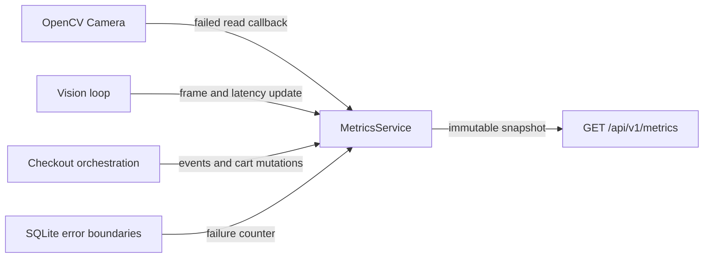

# Production Phase 17: Lightweight Metrics Design

## Goal

Add bounded, thread-safe, in-process metrics for the realtime vision loop,
checkout behavior, cart state, camera failures, and SQLite failures. Expose one
JSON snapshot for local inspection without introducing Prometheus, Grafana, a
time-series database, per-frame INFO logging, or metric persistence.

## Scope

This phase adds observation only. It does not change YOLO inference, ByteTrack
association, checkout-zone transitions, cart membership rules, SQLite history,
OpenCV rendering, or health/readiness semantics.

## Architecture

A single `MetricsService` is created in the composition root and explicitly
passed to the application coordinator. The vision loop and business-event
orchestration update it at existing lifecycle boundaries. The API reads an
immutable snapshot of the same service.

`OpenCVCamera` receives an optional zero-argument dropped-frame callback rather
than depending on `MetricsService`. This keeps the camera adapter reusable while
allowing every failed capture attempt, including recovered attempts, to be
counted.

## Metrics model

`MetricsSnapshot` is a frozen dataclass containing:

| Metric | Kind | Meaning |
|---|---|---|
| `frames_processed_total` | Counter | Frames that completed vision and checkout processing. |
| `dropped_frames_total` | Counter | Failed camera read attempts, including attempts later recovered. |
| `detections_total` | Counter | Accepted frame observations returned by the current tracker adapter. |
| `active_tracks` | Gauge | Unique non-null track IDs in the latest processed frame. |
| `inference_latency_ms` | Rolling average | Mean YOLO/ByteTrack latency over the bounded recent-frame window. |
| `frame_processing_latency_ms` | Rolling average | Mean vision-plus-checkout processing latency over the same window. |
| `current_fps` | Gauge | Latest FPS value already calculated by the application loop. |
| `checkout_enter_events_total` | Counter | Confirmed checkout `ENTER` transitions. |
| `checkout_exit_events_total` | Counter | Confirmed checkout `EXIT` transitions. |
| `cart_additions_total` | Counter | Successful exact-track cart additions. |
| `cart_removals_total` | Counter | Successful exact-track removals, including tracking expiry. |
| `cart_resets_total` | Counter | Accepted OpenCV or API reset commands, including an empty reset. |
| `current_cart_items` | Gauge | Physical item quantity from one consistent cart snapshot. |
| `current_cart_total` | Gauge | Integer-currency cart total from the same snapshot. |
| `uptime_seconds` | Gauge | Monotonic elapsed time since `MetricsService` construction. |
| `camera_errors_total` | Counter | Camera initialization or exhausted-read failures caught by the application. |
| `persistence_errors_total` | Counter | Actual caught SQLite initialization, read, session, or write failures. |

Counters never decrease. Gauges describe the most recently committed state.
Latency averages store only the most recent configured number of samples, not
every historical frame.

## Service interface and synchronization

`MetricsService` uses one non-reentrant `threading.Lock`. Each update holds it
only for numeric assignments and bounded `deque` operations. `get_snapshot()`
calculates both latency averages and copies every field during one acquisition,
so the API cannot combine counters and gauges from different updates.

The public methods are intentionally operation-oriented:

- `record_frame(...)`
- `record_dropped_frame()`
- `record_checkout_event(event_type)`
- `record_cart_addition(cart_snapshot)`
- `record_cart_removal(cart_snapshot)`
- `record_cart_reset(cart_snapshot)`
- `record_camera_error()`
- `record_persistence_error()`
- `get_snapshot()`

The service validates that counts and measured values are nonnegative. It has no
dependency on OpenCV, Ultralytics, FastAPI, SQLite, or terminal output.

## Timing and data flow

Both latency measurement and uptime use `time.perf_counter`, which is monotonic
and high resolution.

For each successfully read frame:

1. Start frame-processing timing immediately before `VisionPipeline.process`.
2. Run YOLO/ByteTrack and receive its existing inference latency.
3. Run checkout event processing and cart mutations.
4. Stop frame-processing timing before OpenCV rendering.
5. Record one atomic frame update with detection count, unique active IDs,
   latency values, and the current FPS.

UI rendering and camera capture are excluded from `frame_processing_latency_ms`;
the metric specifically profiles vision and checkout computation. Failed frame
reads do not increment `frames_processed_total`.

Confirmed zone events increment enter/exit counters whether or not they mutate
the cart. Addition/removal counters increment only after `CartService` reports a
successful mutation. Reset increments only after the event engine and cart are
successfully cleared.

## Camera and persistence failures

Every failed `VideoCapture.read()` attempt invokes the dropped-frame callback.
If all attempts fail, the coordinator also increments `camera_errors_total` when
it catches `CameraError`. Camera initialization failure counts as one camera
error but not a dropped frame.

`persistence_errors_total` increments at the code boundary that catches a real
`PersistenceError`. Repeated API requests made after persistence has already
been disabled do not create artificial new persistence failures.

Metrics updates perform no logging. Existing structured error and lifecycle
logs remain unchanged, and no per-frame metric is logged at INFO.

## Configuration

Add immutable `MetricsConfig` with `rolling_window_size=60`. It is configurable
through `SMART_RETAIL_METRICS_ROLLING_WINDOW_SIZE` and rejects values below one.
No sampling, exporter, labels, or histogram configuration is introduced.

## API

Add `GET /api/v1/metrics` with a Pydantic response model matching every snapshot
field. It always performs a single in-memory snapshot read and returns HTTP 200
while the API is live. The route does not query SQLite or interact with the
camera or model.

## Testing

Tests remain deterministic and hardware-free:

- counters increment and never affect unrelated counters;
- gauges replace their previous values;
- rolling latency averages evict samples beyond the configured window;
- uptime uses an injected monotonic clock;
- concurrent updates and snapshots preserve nonnegative, internally valid
  values;
- camera read failures invoke the dropped-frame callback;
- checkout mutation and reset instrumentation follows existing success rules;
- persistence and camera exceptions increment their system counters;
- `/api/v1/metrics` returns the shared snapshot and appears in OpenAPI.

The complete pre-existing suite must continue to pass.

## Files

Create:

- `src/smart_retail/metrics.py`
- `src/smart_retail/api/routes/metrics.py`
- `tests/test_metrics.py`
- `docs/METRICS.md`

Modify:

- `src/smart_retail/app.py`
- `src/smart_retail/config.py`
- `src/smart_retail/infrastructure/camera.py`
- `src/smart_retail/api/factory.py`
- `src/smart_retail/api/models.py`
- application/API/camera/config test fixtures
- `.env.example`, `README.md`, and architecture/concurrency documentation

## Future export path

A later Prometheus adapter can translate `MetricsSnapshot` counters and gauges
without changing the vision or checkout code. Histograms, labels, scraping
middleware, and external monitoring infrastructure are deliberately deferred.
