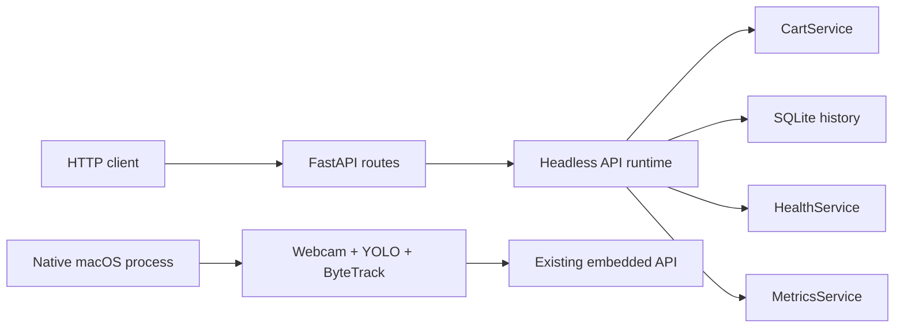

# Production Phase 19 Containerization Design

## Goal

Containerize the reproducible service-oriented parts of Smart Retail Checkout—
FastAPI, SQLite history, in-memory cart state, health, metrics, and focused
tests—without making Docker Desktop webcam passthrough the supported macOS demo
path. The existing native `python app.py` webcam application remains unchanged.

## Deployment boundary

The production image runs a new headless API composition path. It does not
import or initialize OpenCV, Ultralytics, PyTorch, YOLO, ByteTrack, MPS, or a
camera. It reuses these existing components:

- `CartService` and immutable cart snapshots;
- `SQLiteCheckoutRepository` and the product catalog;
- `HealthService` and `MetricsService`;
- the existing FastAPI routes, Pydantic schemas, and exception handlers;
- the existing configuration and structured logging system.



The headless service is not a remote inference service and does not receive
video. It is a reproducible API/persistence deployment target and a place to
exercise the service contract independently of webcam hardware.

## Headless runtime

Create `smart_retail.api.service` containing a small `HeadlessAPIRuntime` and
application factory. The runtime implements the method surface already consumed
by the routes:

- cart snapshot and reset;
- liveness, readiness, and metrics snapshots;
- recent events and sessions;
- one session with its events.

FastAPI lifespan owns runtime startup and shutdown. Startup initializes the
catalog and SQLite schema, creates one checkout session, marks core/database
ready, and sets application state to running. Shutdown closes the active
session with the current cart total and then closes repository ownership.
Lifecycle operations are idempotent and use short locks; SQLite calls remain
outside shared in-memory locks.

The headless reset route uses the same `CartService.clear()` behavior and
persists one `RESET` event through the same repository schema. It does not
duplicate item add/remove rules or create synthetic tracking events.

## Readiness semantics

`HealthService` gains a small general capability to mark selected components
intentionally disabled at construction. Desktop behavior is unchanged. The
headless service reports:

- `core_services=ready`;
- `database=ready` when SQLite is available;
- `model=disabled`;
- `camera=disabled`;
- `vision_pipeline=disabled`.

Disabled components are already readiness-acceptable, so `/ready` returns 200
only when the headless service and enabled database are ready. The service does
not falsely claim that a model or camera was initialized.

## Image design

Use a multi-stage `Dockerfile` based on `python:3.11-slim`:

1. A shared API base installs pinned API-only dependencies, installs the local
   package without resolving its full desktop dependency set, copies the
   product/tracker configuration, creates a writable data directory, and sets
   safe environment defaults.
2. A `test` target copies tests needed for the headless service and runs the
   focused container/API suite without webcam hardware.
3. The default production target runs as an unprivileged `smartretail` user and
   starts `python -m smart_retail.api.service`.

The production image excludes OpenCV, Ultralytics, PyTorch, NumPy, model
weights, datasets, local databases, source-control metadata, virtual
environments, and caches. This materially reduces build time and image size
compared with installing the desktop dependency set.

Create `requirements-api.txt` containing only the pinned runtime packages
required by FastAPI service mode. There is no Docker Compose file because the
service has no separate database or broker container.

## Runtime configuration

The image defines non-secret defaults:

- `SMART_RETAIL_API_HOST=0.0.0.0`;
- `SMART_RETAIL_API_PORT=8000`;
- `SMART_RETAIL_DATABASE_PATH=/app/data/smart_retail.db`;
- product and tracker paths under `/app/configs`;
- console-only logging;
- unbuffered Python output.

All settings remain overridable with `docker run -e`. SQLite data can be kept
with a named volume mounted at `/app/data`. No `.env` file or secret value is
copied into the image.

## Health check and logs

Expose port 8000. The image health check uses Python's standard-library HTTP
client to request `http://127.0.0.1:8000/health`, avoiding an extra curl package.
Application and Uvicorn logs go to stdout/stderr. File logging remains optional
through existing configuration but is not enabled in the image.

## Docker build context

Create `.dockerignore` covering at least:

- `.git`, `.venv`, editor files, and macOS metadata;
- Python/test/type-check caches and coverage output;
- `.env` files except the safe example;
- SQLite databases and sidecars;
- downloaded `*.pt` models, datasets, and training runs;
- logs and other local runtime output.

Source, API-only requirements, package metadata, configurations, README, and
focused tests remain available to the relevant stages.

## Verification

Test-first host coverage will verify headless lifecycle, readiness, reset,
history, metrics, and idempotent shutdown. Container verification will:

1. build the test target and run its focused tests;
2. build the default production image;
3. start it with a temporary named volume and mapped local port;
4. verify `/health`, `/ready`, and the OpenAPI document;
5. stop the container and confirm graceful session/database shutdown logs.

The complete native test suite must remain green. Docker Desktop must be
running for image verification; if its daemon is unavailable, starting Docker
Desktop is an explicit execution prerequisite rather than a code failure.

## Documentation

Create `docs/CONTAINERIZATION.md` and update `README.md` with exact build, test,
run, volume, configuration, health, and log commands. Documentation will state
prominently that Docker Desktop on macOS does not provide the primary supported
webcam path. The portfolio webcam demo continues to run natively with:

```bash
python app.py
```

## Explicit non-goals

- No webcam or video-device passthrough in Docker Desktop on macOS.
- No YOLO/ByteTrack inference in the API container.
- No video streaming endpoint.
- No Docker Compose, PostgreSQL, Redis, broker, reverse proxy, or cloud service.
- No secrets baked into image layers.
- No changes to detection, tracking, checkout-zone, or cart algorithms.
